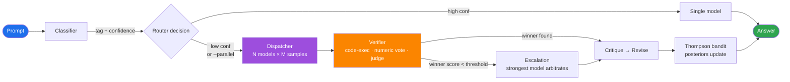

<div align="center">

```
   ┌─┐┬  ┌─┐┌─┐┌┬┐  ┬─┐┌─┐┬ ┬┌┬┐┌─┐┬─┐
   ├┤ │  ├┤ ├┤  │   ├┬┘│ ││ │ │ ├┤ ├┬┘
   ┴  ┴─┘└─┘└─┘ ┴   ┴└─└─┘└─┘ ┴ └─┘┴└─
```

# Fleet Router

### Adaptive parallel LLM router with **verifier-driven synthesis** for open-source models on Ollama

*Quality-first. Not fastest. Not cheapest. **Best answer.***

[](https://www.python.org/downloads/)
[](#testing)
[](LICENSE)
[](https://ollama.com)
[](#quality-by-default)
[](#drop-in-backends)

</div>

---

## Table of Contents

- [Why Fleet?](#why-fleet)
- [Quick Start](#quick-start)
- [Architecture](#architecture)
- [Features](#features)
- [Models](#models)
- [Drop-in Backends](#drop-in-backends) ← _Claude Code, aider, OpenAI SDK_
- [CLI](#cli)
- [Python API](#python-api)
- [Configuration](#configuration)
- [How It Works](#how-it-works)
- [Eval Harness](#eval-harness)
- [Testing](#testing)
- [Project Layout](#project-layout)

---

## Why Fleet?

A single LLM call is a guess. **Fleet is a system.**

<table>
<tr>
<th width="50%">Single Ollama call</th>
<th width="50%">Fleet</th>
</tr>
<tr>
<td>

- 1 opinion per prompt
- No quality signal
- No wrong-answer detection
- No self-improvement
- No refinement
- No disagreement arbitration
- No eval harness
- ✅ Local
- 💰 1 call

</td>
<td>

- **3 models × up to 7 samples** (≈21 opinions)
- **Code execution / numeric vote / LLM judge**
- **Calibrated abstention**
- **Thompson-sampling bandit on outcomes**
- **Critique → revise** pass (default ON)
- **Escalation to strongest model** (default ON)
- **Built-in, with regression gating**
- ✅ Local
- 💰 up to ~25 calls per prompt _(the trade)_

</td>
</tr>
</table>

The trade: **per-prompt latency goes 10–30× and cost goes 20–80×, in exchange for measurably better answers.** If you want fast and cheap, this isn't it.

### Quality by default

Out of the box, every quality lever is **ON**: parallel ensemble, multi-sample self-consistency, verifier-driven scoring, LLM-as-judge, calibrated abstention, disagreement escalation, critique-and-revise refinement, and bandit learning. The only quality lever that ships **OFF** is `code_execute` — running LLM-generated code is a real RCE vector even with static safety checks, so opting in is a deliberate choice.

To downshift (faster, cheaper, lower quality), opt out explicitly in `~/.fleet/config.yaml`. See [Configuration](#configuration).

---

## Quick Start

```bash
git clone https://github.com/sambawy01/fleet-router.git
cd fleet-router
python -m venv venv && source venv/bin/activate
pip install -e ".[dev]"

# Make sure Ollama is running with at least one model pulled
ollama pull deepseek-v4-pro:cloud

# Ask away — single prompt, max-quality routing
fleet "solve 2x + 5 = 13"
fleet --parallel "compare microservices vs monolith"
fleet --model glm-5.1 "write a poem about lighthouses"

# Run the eval harness
fleet --eval evals/fixtures/hard/
```

> [!TIP]
> Add `~/fleet-router/venv/bin` to your `PATH` (or symlink `fleet` into `~/.local/bin`) so you can call `fleet` from any directory without `source`-ing a venv.

---

## Architecture



### The synthesis layer

| Tag | Verifier | Quality Signal |
|---|---|---|
| `code` | `CodeVerifier` | AST validity + (opt-in) sandboxed execution |
| `math` | `MathVerifier` | Numeric extraction + cross-sample majority vote |
| `reasoning`, `creative`, `summarize`, `translate`, `general` | `JudgeVerifier` | LLM-as-judge with tag-specific rubric |
| any (fallback) | `HeuristicVerifier` | Length / AST / diversity (legacy synthesizer) |

---

## Features

### 🔬 Verifier-driven synthesis
No more "longest" or "lexically diverse" winning. Each tag has an executable or judge-based scorer. Code is AST-validated (and optionally sandbox-executed). Math runs majority vote over numeric answers. Reasoning/creative/etc. go to an LLM judge with a tag-specific rubric.

### 🎯 Self-consistency sampling
Math and reasoning tags sample the same model N times (default 5 / 3) and majority-vote. On GSM8K-class problems this closes most of the gap to frontier models with the same base LLM.

### 🛑 Calibrated abstention
When no candidate clears the quality bar, fleet returns a structured "I don't know — here are the top candidates and why I can't pick" instead of a confident wrong answer.

### ⚖️ Disagreement escalation
Opt-in: when the verifier abstains or the winner score is weak, fleet hands all candidates to a configured stronger Ollama model for arbitration.

### 🔁 Multi-pass refinement
Opt-in: critique pass identifies errors, revise pass fixes them. ~5–20pp quality lift on most tasks. Doubles latency.

### 📈 Outcome-driven bandit
Thompson-sampling Beta posteriors per `(tag, model)`. Reward = verifier/judge score (NOT latency). Persists to JSON. Learns which open-source model is actually best for *your* prompt distribution.

### 🧠 Thinking-model aware
`<thinking>...</thinking>` chain-of-thought blocks are stripped before scoring AND before returning, so reasoning models aren't penalized for verbose internal reasoning and users only see the final answer.

### 🧪 Eval harness with regression gating
JSONL fixtures + per-tag scorers + multi-choice + comparison harness. `fleet --eval --baseline path.json` exits non-zero on >3pp regression — wire it into CI.

### 📡 Live progress
Default-on stderr ticker so you see `→ classified as 'creative' (0.42)` / `→ dispatching 3 models × 5 samples` / `→ synthesized [verifier]: winner=glm-5.1 (0.78)` instead of staring at a black 60–180s pause. `--quiet` suppresses.

---

## Models

This project routes **only to open-source LLMs running on Ollama** (local or `:cloud` tags). Default config:

| Model | Best For | Ollama Tag |
|---|---|---|
| 🌟 **Kimi K2.6** | General default — broad coverage | `kimi-k2.6:cloud` |
| **DeepSeek V4 Pro** | Code, reasoning, math | `deepseek-v4-pro:cloud` |
| **GLM 5.1** | Creative writing, Chinese, long context | `glm-5.1:cloud` |
| **MiniMax 2.7** | Summarization, dialogue | `minimax-m2.7:cloud` |
| **DeepSeek V4 Flash** | Fast drafts | `deepseek-v4-flash:cloud` |

Drop in any other Ollama model — Qwen, Llama, GPT-OSS, etc. — by adding it to `~/.fleet/config.yaml`.

> [!NOTE]
> OpenAI / Anthropic / proprietary providers are **intentionally not supported** as router targets. The value prop is "best outcome on open-source models." See the next section for using fleet *as a backend for* clients that already speak those APIs.

---

## Drop-in Backends

Fleet's HTTP proxy (`fleet --serve`) speaks **two API dialects**, so any tool that talks to Anthropic Messages or OpenAI Chat Completions can route through fleet → Ollama with a couple of env vars:

| Client | API dialect | Endpoint | Status |
|---|---|---|:---:|
| **Claude Code** | Anthropic | `POST /v1/messages` | ✅ |
| **`anthropic` SDK** | Anthropic | `POST /v1/messages` | ✅ |
| **aider** | OpenAI | `POST /v1/chat/completions` | ✅ |
| **`openai` SDK** | OpenAI | `POST /v1/chat/completions` | ✅ |
| **LiteLLM, llama.cpp UIs, …** | OpenAI | `POST /v1/chat/completions` | ✅ |

Plus utility endpoints: `GET /v1/models` (OpenAI-style listing), `GET /healthz`.

> [!IMPORTANT]
> **Tool / function calling is flattened to text** in both dialects. Anthropic `tool_use`/`tool_result` blocks and OpenAI `tool_calls` payloads don't map cleanly onto fleet's single-prompt-in / single-answer-out interface, so they're rendered as readable summaries the model can see — but it can't *issue* tool calls back to the client. **Plain chat works; agentic tool loops do not.**

### As a Claude Code backend

```bash
# 1. Start the proxy (defaults: 127.0.0.1:8765)
fleet --serve --port 8765 --api-key fleet-local &

# 2. Point Claude Code at it
export ANTHROPIC_BASE_URL=http://localhost:8765
export ANTHROPIC_API_KEY=fleet-local

# 3. Use Claude Code as normal — every prompt routes through fleet → Ollama
claude
```

### As an aider backend

```bash
# 1. Same proxy as above. Then:
export OPENAI_API_BASE=http://localhost:8765/v1
export OPENAI_API_KEY=fleet-local

# 2. Pick any fleet-known model (the openai/ prefix is litellm convention)
aider --model openai/kimi-k2.6
aider --model openai/deepseek-v4-pro    # max-quality reasoning
aider --model openai/glm-5.1            # creative / Chinese / long context
```

Or pin it permanently in `~/.aider.conf.yml`:

```yaml
openai-api-base: http://localhost:8765/v1
openai-api-key:  fleet-local
model:           openai/kimi-k2.6
weak-model:      openai/kimi-k2.6
show-model-warnings: false
```

### Force-model honoring

The proxy resolves the request's `model` field against the fleet registry and **passes it through as `force_model`** when it matches — so `--model openai/glm-5.1` actually forces glm-5.1 instead of triggering the classifier+ensemble. Unknown names (Claude Code's `claude-opus-4-7`, the placeholder `fleet-router`, etc.) keep auto-route behavior. Provider prefixes (`openai/`, `anthropic/`, `ollama/`, `fleet/`) are stripped automatically; `:cloud` suffixes are tolerated.

### Auto-start hook for Claude Code

Inside the fleet-router project, `.claude/settings.json` registers a SessionStart hook that runs `scripts/fleet-ensure-proxy.py` — an idempotent, flock-guarded boot that starts the proxy if it's not up and polls `/healthz`. Open a chat in `~/fleet-router` and the proxy is ready before your first message.

### Toggle script

A ready-to-use shell helper ships at [`scripts/fleet-toggle.sh`](scripts/fleet-toggle.sh):

```bash
# in ~/.zshrc or ~/.bashrc
source /path/to/fleet-router/scripts/fleet-toggle.sh
```

```bash
fleet-on      # boots proxy + sets ANTHROPIC_BASE_URL in this shell
claude        # routes through fleet → Ollama
fleet-status  # show proxy + env state
fleet-off     # stop proxy + unset env vars; claude goes back to Anthropic
```

> [!WARNING]
> The proxy binds to `127.0.0.1` by default (local only). If you set `--host 0.0.0.0`, **always** also set `--api-key` to prevent open access to your Ollama compute. Auth accepts `x-api-key` (Anthropic style) or `Authorization: Bearer <key>` (OpenAI style) — both are constant-time compared.

---

## CLI

```bash
fleet "<prompt>"                         # auto-route, verifier synthesis
fleet --parallel "<prompt>"              # force parallel mode
fleet --model glm-5.1 "<prompt>"         # force a specific model (skips classifier)
fleet --config ~/.fleet/config.yaml ...  # custom config
fleet -v "<prompt>"                      # verbose logging to stderr
fleet -q "<prompt>"                      # suppress per-step progress lines

# Eval harness
fleet --eval evals/fixtures/                                # run all fixtures
fleet --eval evals/fixtures/hard/                           # discriminating set
fleet --eval evals/fixtures/hard/ --save-baseline base.json # snapshot
fleet --eval evals/fixtures/hard/ --baseline base.json      # regression gate

# Serve as HTTP proxy
fleet --serve --port 8765 --api-key fleet-local             # bind 127.0.0.1:8765
```

**Exit codes:** `0` success · `1` error · `2` sentinel error (e.g. no model available) · `3` regression detected · `130` interrupted.

---

## Python API

```python
import asyncio
from fleet import FleetRouter, load_config

router = FleetRouter(load_config())

async def main():
    answer = await router.ask("solve 5x - 3 = 12")
    print(answer)
    await router.aclose()  # closes the aiohttp pool — silences warnings

asyncio.run(main())
```

### Side-by-side comparison

```python
from evals.compare import compare

report = await compare(
    a=("baseline", baseline_router),
    b=("fleet",    fleet_router),
    fixtures_dir="evals/fixtures/hard/",
)
print(report["summary"])
```

---

## Configuration

Resolution order: explicit `--config` path → `~/.fleet/config.yaml` → bundled `fleet/config.yaml` → built-in defaults.

### The shipped defaults (max quality)

```yaml
thresholds:
  single_confidence: 1.01       # >1 → every prompt fans out (always parallel)
  parallel_timeout: 60
  max_parallel: 3

synthesis:
  mode: verifier
  judge_model: deepseek-v4-pro  # strongest model arbitrates judge-based tags
  abstention_threshold: 0.4
  code_execute: false           # OFF for security — opt in only if you trust the sandbox
  code_execute_timeout: 5

sampling:
  samples_by_tag:
    math: 7                     # Wang+ majority-vote sweet spot
    reasoning: 5
    code: 3                     # execution check is the strong signal
    default: 3                  # everything else: 3 drafts for the judge
  temperature: 0.7

refinement:
  enabled: true                 # critique → revise pass
  critique_model: deepseek-v4-pro

escalation:
  enabled: true                 # arbitrate divergent answers via stronger model
  model: deepseek-v4-pro
  score_threshold: 0.6

bandit:
  enabled: true                 # outcome-driven Thompson sampling
  state_path: ~/.fleet/bandit.json   # persists posteriors across runs
```

### Downshift recipe (faster, cheaper, less quality)

Drop this in `~/.fleet/config.yaml` to flip every quality lever off:

```yaml
thresholds:
  single_confidence: 0.8        # high-confidence classifications go single-model
sampling:
  samples_by_tag: { default: 1 }
synthesis:
  mode: heuristic               # length/AST picker, no judge calls
refinement:   { enabled: false }
escalation:   { enabled: false }
bandit:       { enabled: false }
```

### Cloud-models recipe

To use Ollama Cloud models (`:cloud` suffix), point `base_url` at `https://ollama.com` and set your API key from [ollama.com/settings/keys](https://ollama.com/settings/keys):

```yaml
ollama:
  base_url: https://ollama.com
  api_key: "<your-key>"
```

The provider sends `Authorization: Bearer <api_key>` plus `Accept: application/json` — required by Ollama Cloud or it returns `{"error":"unauthorized"}`.

### Full schema

```yaml
ollama:
  base_url: http://localhost:11434
  api_key: ""                   # set when Ollama requires auth (e.g. cloud models)

models:
  kimi-k2.6:
    tags: [code, reasoning, math, creative, chinese, long_context, summarize, dialogue, translate, general]
    priority: 1                 # default — wins across every tag
    api_model: kimi-k2.6
  deepseek-v4-pro:
    tags: [code, reasoning, math]
    priority: 2
    class: reasoning            # "chat" or "reasoning"
    api_model: deepseek-v4-pro:cloud  # optional override
  glm-5.1:
    tags: [creative, chinese, long_context]
    priority: 3
  # ... etc

classifier:
  embeddings_model: all-MiniLM-L6-v2
  mode: keyword                 # "keyword" or "llm"
  llm_model: ""                 # set to an Ollama model when mode=llm

retrieval:
  enabled: false
  tags: []                      # tags to augment, e.g. [reasoning, general]
  provider: noop                # "noop" or "websearch" (needs SERP_API_KEY)
  max_chars: 4000
```

---

## How It Works

### Classification

Keyword regex with **saturating exponential** scoring (1 match → 0.55, 2 → 0.80, 3+ → 0.91). Single accidental matches stay below the parallel-mode threshold. Optional sentence-transformer embedding adds a bounded bonus to the dominant tag. Optional `LLMClassifier` for harder cases.

### Routing Decision

| `single_confidence` | Behavior |
|---|---|
| `1.01` (default) | Every prompt fans out to up to N models × M samples |
| `0.8` (downshift) | High-confidence (≥0.8) classifications go single-model fast path |
| `--parallel` flag | Forces parallel regardless of threshold |
| `--model X` / proxy `model: X` | Bypasses classifier entirely; goes straight to model X |

### Verification

Per-tag verifiers replace heuristics. `CodeVerifier` AST-walks for dangerous patterns (subprocess, eval, file I/O, network) and **refuses to execute** unsafe code even with `code_execute=true`. `MathVerifier` extracts final numeric answers (handling `\boxed{}`, "answer is X", scientific notation, decimals) and majority-votes. `JudgeVerifier` sends labeled candidates to an Ollama judge with a tag-specific rubric and parses ranked output (with JSON-extraction fallback for verbose models).

### Calibrated Abstention

When the winner's score is below `abstention_threshold` OR the verifier flags abstention, fleet returns:

```
(uncertain — <reason>)

Top candidates considered:

--- model-a#0 (score=0.30) ---
<answer>

--- model-b#0 (score=0.30) ---
<answer>
```

Beats a confident wrong answer.

### Outcome-Driven Bandit

Thompson sampling over `(tag, model)` Beta posteriors. **Reward signal = verifier/judge score in [0,1]** — never latency, never cost. Each sampled candidate is an independent observation, so `samples_per_model=5` gives the bandit 5× more signal per dispatch. State persists atomically to `~/.fleet/bandit.json`. With bandit enabled, the router Thompson-ranks the **full** tag-matching pool (not just `max_parallel` head-of-line candidates) so it can explore.

---

## Eval Harness

Fixtures are JSONL — one case per line. Each gets routed through fleet and scored by a tag-default or per-case scorer.

```jsonl
{"tag": "code", "prompt": "Write merge_intervals(intervals)", "test_code": "assert merge_intervals([[1,3],[2,6]]) == [[1,6]]"}
{"tag": "math", "prompt": "What is gcd(252, 105)?", "expected": 21}
{"tag": "reasoning", "scorer": "multi_choice", "prompt": "...\n(A) ... (B) ...", "expected": "B"}
```

Built-in scorers:

| Scorer | Score = | Used For |
|---|---|---|
| `CodeExecScorer` | 1.0 if `code + test_code` exits 0, else 0.0 | code |
| `NumericMatchScorer` | 1.0 if final number matches `expected` (rel-tol) | math |
| `MultipleChoiceScorer` | 1.0 if extracted A/B/C/D/E matches | reasoning (MMLU-style) |
| `KeywordContainsScorer` | fraction of expected keywords present | summarize, creative, general |

---

## Testing

```bash
pytest tests/                # 244 passing
pytest tests/verifiers/      # verifier framework
pytest tests/evals/          # harness + scorers
pytest tests/test_proxy.py   # Anthropic + OpenAI proxy compatibility
pytest tests/test_cli.py     # CLI: ask / eval / serve / quiet
```

244 tests across 22 files cover providers, verifiers (code/math/judge/heuristic), self-consistency, escalation, refinement, abstention, bandit (selection + posterior updates + persistence), event bus + progress sink, LLM classifier, retrieval, eval harness + comparison harness, CLI (including eval + serve subcommands + aclose lifecycle), Anthropic + OpenAI proxy compatibility (parsing, streaming, force-model resolver, auth, ollama-down enrichment), max-quality default policy, and config validation.

---

## Roadmap

| Status | Feature |
|---|---|
| ✅ Shipped | Verifier framework, self-consistency, calibrated abstention, bandit, eval harness, refinement, escalation, retrieval scaffold, event bus |
| ✅ Shipped | Anthropic Messages API proxy + OpenAI Chat Completions proxy (drop-in backend for Claude Code, aider, and openai SDK) |
| ✅ Shipped | Force-model honoring in proxy + live stderr progress lines + idempotent SessionStart auto-boot |
| 🛠 Next | Class-aware streaming with thinking-model-safe cancellation |
| 💭 Considering | LLM classifier as default, retrieval for `general` tag by default, Strategy plugin registry via entry points, real tool-call translation in proxy |

---

## Project Layout

```
fleet-router/
├── fleet/
│   ├── classifier.py          # keyword + embeddings
│   ├── llm_classifier.py      # zero-shot via instruct model
│   ├── config.py              # YAML schema + validation
│   ├── dispatcher.py          # multi-sample parallel dispatch
│   ├── registry.py            # Ollama model discovery
│   ├── router.py              # orchestration: classify → dispatch → verify → ...
│   ├── synthesizer.py         # legacy heuristic picker
│   ├── bandit.py              # Thompson sampling + persistence
│   ├── events.py              # typed event bus + sinks (incl. cli_progress_sink)
│   ├── retrieval.py           # NoOp + WebSearch (SerpAPI-shape)
│   ├── proxy.py               # Anthropic + OpenAI HTTP proxy
│   ├── providers/             # Provider Protocol + Ollama
│   └── verifiers/             # Verifier Protocol + per-tag scorers
├── evals/
│   ├── runner.py              # load → score → aggregate → compare
│   ├── compare.py             # side-by-side router comparison
│   ├── scorers/               # code-exec, numeric, multi-choice, keyword
│   └── fixtures/              # easy + hard JSONL sets
├── scripts/
│   ├── fleet-toggle.sh        # shell-scoped opt-in for Claude Code backend
│   └── fleet-ensure-proxy.py  # idempotent flock-guarded auto-boot
└── tests/                     # 244 tests across 22 files
```

---

## Requirements

- Python 3.12+
- Ollama (local or `:cloud` tags)
- Optional: `sentence-transformers` for embedding-based classification

## License

MIT
